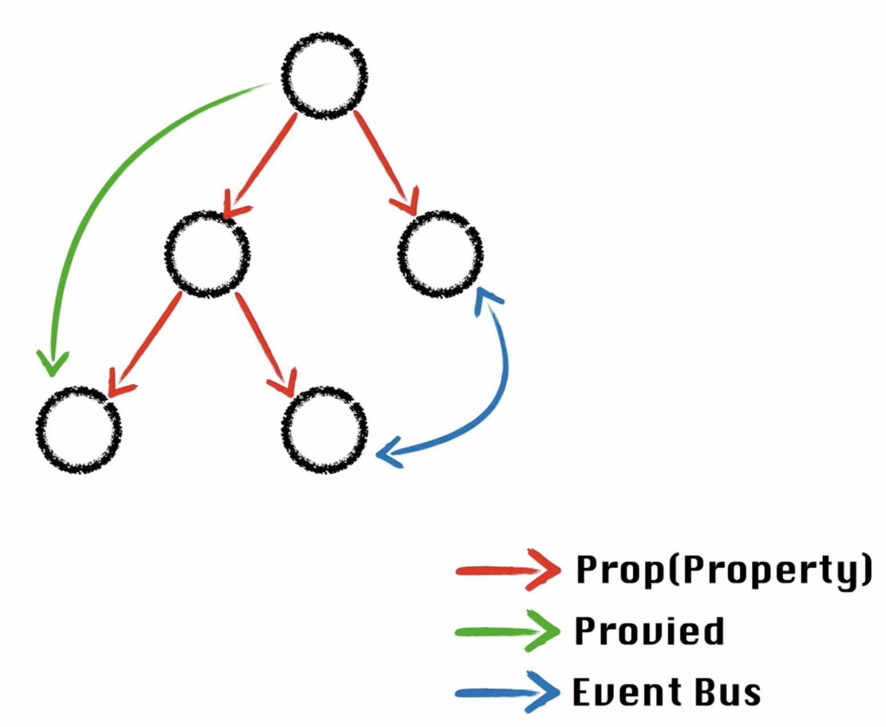
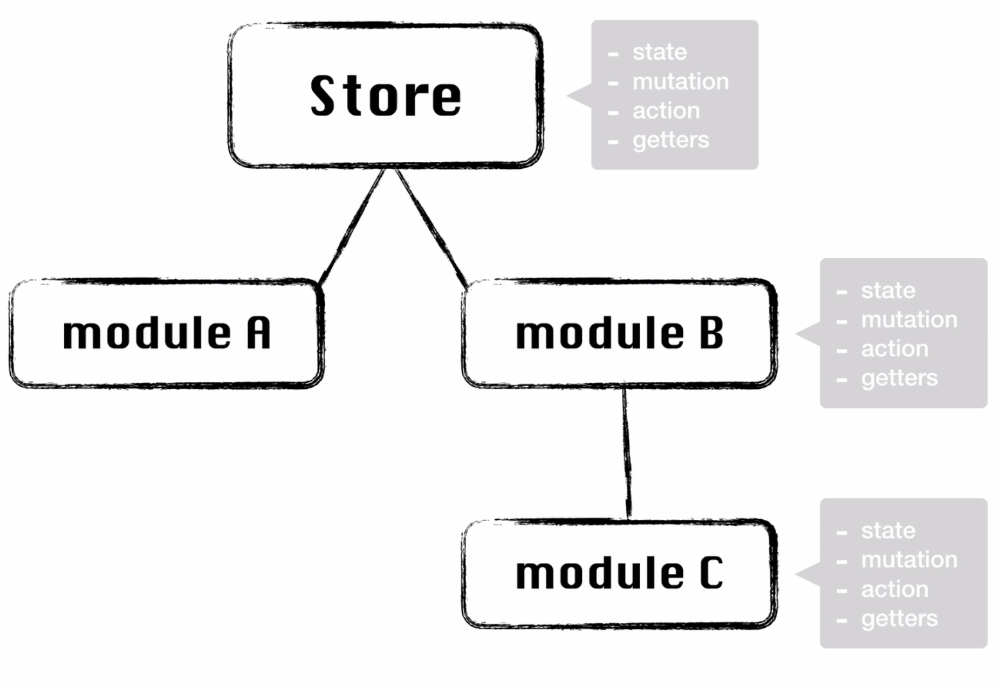

# Interface 로 Vuex 설계하기

## Vue의 데이터흐름과 Vuex
### event bus 
* @/common/event-bus.ts
```typescript
<template>
  <div>
    <A></A>
    <B></B>
  </div>
</template>
<script lang="ts">
  import { Component, Vue } from "vue-property-decorator";
  import { A, B } from "@/components/Common";

  @Component({
    components: { B, A }
  })
  export default class App extends Vue {
  }
</script>
```

* a.vue
```typescript
<template>
<div>
    <input type="text" v-model="text">
    <button @click="click">b로 전송</button>
</div>
</template>

<script lang="ts">
    import { Vue, Component } from 'vue-property-decorator';
    import Bus from '@/common/event-bus.ts';

    @Component
    export default class A extends Vue {
      text: string = '';

      click() {
        Bus.$emit('sendText', this.text);
      }
    }
</script>
```

* b.vue
```typescript
<template>
    <div>
        a에서 작성한 메세지는? => {{ text }}
    </div>
</template>

<script lang="ts">
    import { Vue, Component } from 'vue-property-decorator';
    import Bus from '@/common/event-bus.ts';

    @Component
    export default class B extends Vue {
      text: string = '';
      created() {
        Bus.$on('sendText', (text: string) => {
          this.text = text;
        })
      }
    }
</script>
```




## Vuex interface를 구현하여 Store 개발하기
### interface
* ?: 는 값이 있어도 되고 없어도 된다는 옵션의 의미
```typescript
interface SquareConfig {
    color?: string;
    width?: number;
}
function createSquare(config: SquareConfig): { color: string; area: number } {
    let newSquare = { color: 'white', area: 100 };
    if (config.color) {
        newSquare.color = config.color;
    }
    if (config.width) {
        newSquare.area = config.width * config.width;
    } 
    return newSquare;
}

let mySquare = createSquare({color: 'black'})
```

### generic
```typescript
function identity(arg: number): number {
    return arg;
}
```
```typescript
function identity<T>(arg: T): T {
    return arg;
}
```

### Vuex Store
props, event-bus 등을 이용한 방법은 프로젝트가 커질수록 데이터의 흐름을 알기 어렵다.

```typescript
import Vue from 'vue';
import Vuex, {Action, ActionContext, StoreOptions} from 'vuex';

Vue.use(Vuex);

interface State {
    // 상태값에 대한 인터페이스    
    count: number;
}

const Store: StoreOptions<State> = {
    state: {
        // 상태값
        count: 0,
    },
    mutations: {
        // 상태 변이 함수: 데이터의 흐름일 알기 쉽게하기 위함.
        setCount(state: State, count: number) {
              state.count = count;
        }
    },
    actions: {
        // 상태 변이를 위한 로직 함수
        // increase({state, getters, dispatch, commit}): ActionContext<State. State> {
        increase({state, commit}: ActionContext<State, State>) {
          commit('setCount', state.count + 1);
        },
        decrease({state, commit }: ActionContext<State, State>) {
          commit('setCount', state.count - 1);
        },
    },
    getters: {
        // 대한 계산된 값을 반환하는 함수 (ex. 아이템 리스트를 필터링)
        count: (state: State) => state.count,
    },
};

export default new Vuex.Store(Store);
```
```typescript
<template>
    <div>
        {{ $store.getters.count }}
    </div>
</template>
<script lang="ts">
  import {Vue, Component} from 'vue-property-decorator';

  @Component
  export default class Count extends Vue { }
</script>
```

## Store 분리 : Vuex Module Interface 


* namespace: 
    * 기본적으로 모듈의 state는 root state 에 중첩이 되어 있다.
    * 모듈의 mutations, actions, getters 도 root와 동일하게 전역네임스페이스로 등록이 된다. 
    * namespace 가 true 이면 root에 등록된 이름으로 네임스페이스가 설정된다.
```typescript
import Vue from 'vue';
import Vuex, { StoreOptions, Module } from 'vuex';

Vue.use(Vuex);

interface RootState {}
interface ModuleAState {}
interface ModuleBState {} 

const moduleA: Module<ModuleAState, RootState> = {
    namespaced: true,
    state: {},
    mutations: {},
    actions: {},
    getters: {},
};
const moduleB: Module<ModuleBState, RootState> = {
    state: {},
    mutations: {},
    actions: {},
    getters: {},
};
const moduleA: StoreOptions<RootState> = {
    state: {},
    modules: { moduleA, modulesB },
    mutations: {},
    actions: {},
    getters: {},
};
export default new Vuex.Store(store);
```

```typescript
const store: StoreOptions<RootState> = {
  modules: {
    moduleA,
    moduleB,
  },
  state: {
    data: 'root',
  },
  mutations: {
    setData(state, data: string) {
      state.data = data;
    },
  },
  actions: {
    setRootData({commit}, data: string) {
      commit('setData', data);
    },
  },
  getters: {
    data: (state) => state.data,
  },
};
```
```typescript
const module: Moudle<moduleA, RootState> = {
	namespaced: true,
	state: {
		data: 'moduleA',
	},
	mutations: {
		setData(state, data: string) {
			state.data = data;
		},
	},
	actions: {
		setRootData({commit}, data: string) {
			commit('setData', data);
		},
	},
	getters: {
		data: (state) => state.data,
	},
};
```
```typescript
const module: Moudle<moduleB, RootState> = {
	state: {
		data: 'moduleB',
	},
	mutations: {
		setData(state, data: string) {
			state.data = data;
		},
	},
	actions: {
		setRootData({commit}, data: string) {
			commit('setData', data);
		},
	},
	getters: {
		data: (state) => state.data,
	},
};
```
* 같은 네임스페이스 내의 getter 이름은 겹치면 안된다.
    * namespaced 가 false 인 B모듈은 root의 data 가 변경될 때 같이 변경된다.
        ```
        this.$store.dispatch('setRootData', 'test');
        ```
        { "data": "test", "moduleA": { "data": "test" }, "moduleB": { "data": "test" } }
        ```
        this.$store.dispatch('moduleA/setRootData', 'test');
        ```
        { "data": "root", "moduleA": { "data": "moduleA" }, "moduleB": { "data": "moduleB" } }
        
        
## vuex-module-decorator
* vuex 를 객체형태로 만드는 방법을 배웠다. class style로 만드는 방법을 알아보자.
```typescript
import { Module, VuexModule, Mutation, Action } from 'vuex-module-decorators';

@Module({ namespaced: true, name: 'moduleA'})
export default class ModuleA extends VuexModule {
	data: string = 'moduleA';

	@Mutation
	setData(data: string) {
		this.data = data;
	}
	@Action
	editData(data: string) {
		this.context.commit('setData', data);
	}

	get moduleAdata() {
		return this.data
	}
}
```

## vuex-class
